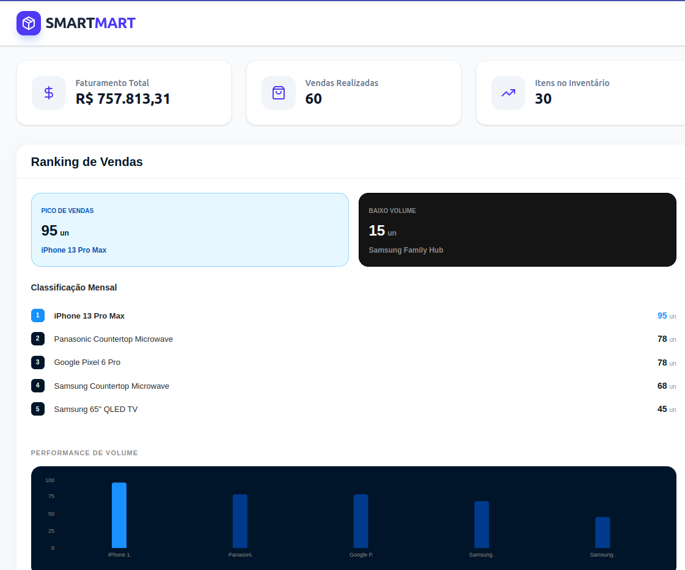
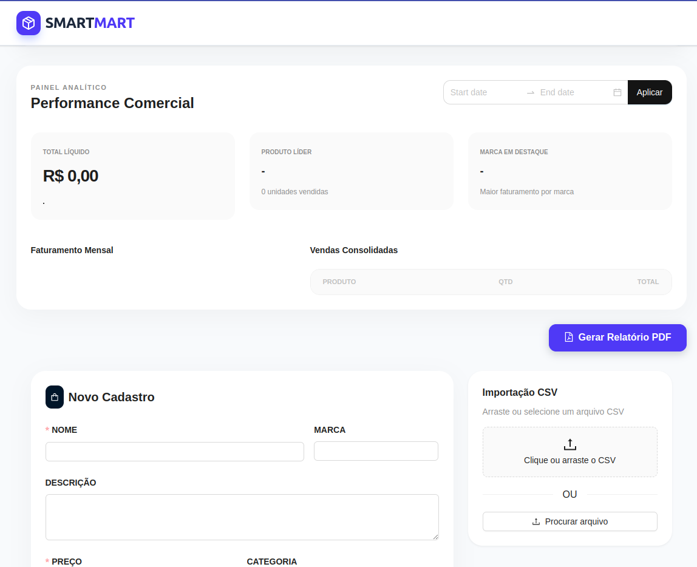
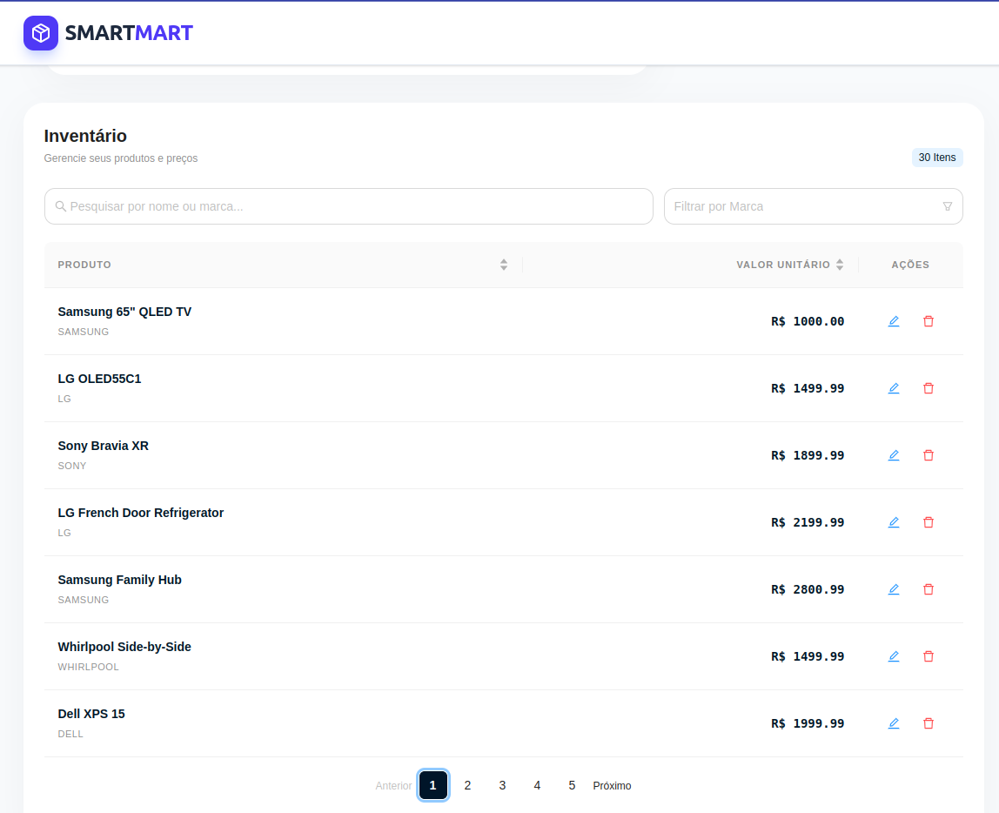

# SmartMart Solutions – Sistema de Gestão de Produtos e Vendas

---

## Sobre o Projeto

Este projeto foi desenvolvido como um protótipo funcional para a SmartMart Solutions, uma empresa varejista digital fictícia.  
O objetivo é fornecer um sistema interno simples e eficiente para cadastro, visualização e análise de produtos e vendas, auxiliando a equipe comercial na tomada de decisões estratégicas.

## Screenshots

A aplicação integra:

- Backend em Python (FastAPI)
- Frontend em React + TypeScript

Oferecendo um **dashboard visual** com indicadores de faturamento, ranking de vendas e controle de inventário.

---

## Objetivos do Sistema

- Cadastrar produtos manualmente ou via arquivo CSV
- Visualizar produtos cadastrados no inventário
- Registrar e listar vendas
- Calcular faturamento total
- Analisar vendas por período
- Exibir indicadores visuais em dashboard

---

## Arquitetura da Aplicação

### Backend
- FastAPI para criação da API REST
- SQLAlchemy para ORM
- SQLite como banco de dados local (`database.db`)
- Pydantic para validação de dados

### Frontend
- React + TypeScript
- Ant Design e TailwindCSS para UI
- Consumo da API via fetch

---

## Funcionalidades do Backend

### Produtos
- `GET /products` – Lista todos os produtos
- `POST /products` – Cria um produto manualmente
- `PUT /products/{id}` – Atualiza um produto
- `DELETE /products/{id}` – Remove um produto
- `POST /products/upload` – Importa produtos via CSV

### Vendas
- `GET /sales` – Lista vendas (com filtro por data)
- `POST /sales` – Cria uma venda
- `GET /sales/total` – Retorna o faturamento total

---

## Importação de Produtos via CSV

O sistema permite importar produtos em massa através de um arquivo CSV.

### Estrutura esperada do CSV:

csv
- name,description,price,brand,category_id
- Notebook Gamer,Notebook alto desempenho,5500.00,Asus,1
- Mouse Wireless,Mouse sem fio,120.50,Logitech,2 

## Regras

- `O arquivo deve ser .csv
- `Todos os campos são obrigatórios
- `O sistema valida tipos e formato antes de salvar

## Como Executar o Projeto
Backend
- pip install fastapi uvicorn sqlalchemy pydantic
- uvicorn main:app --reload
- A API ficará disponível em:
- http://localhost:8000

- 
Frontend
- npm install
- npm run dev
